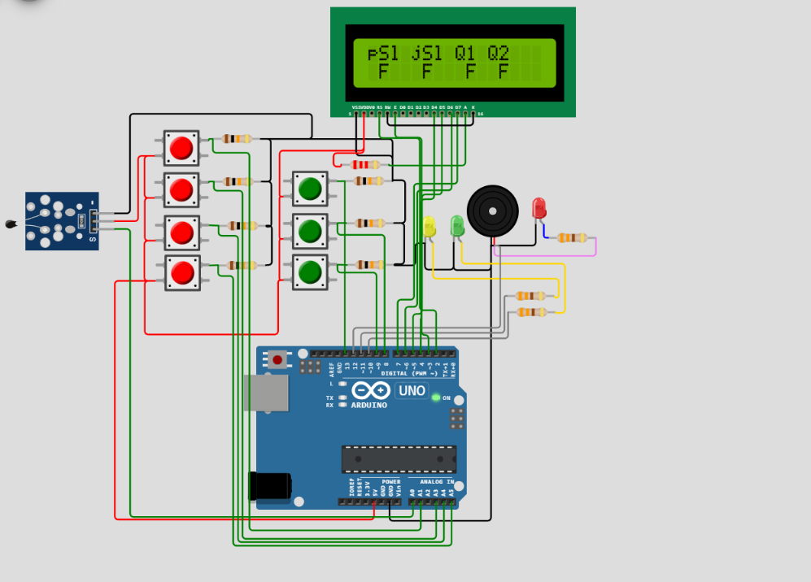
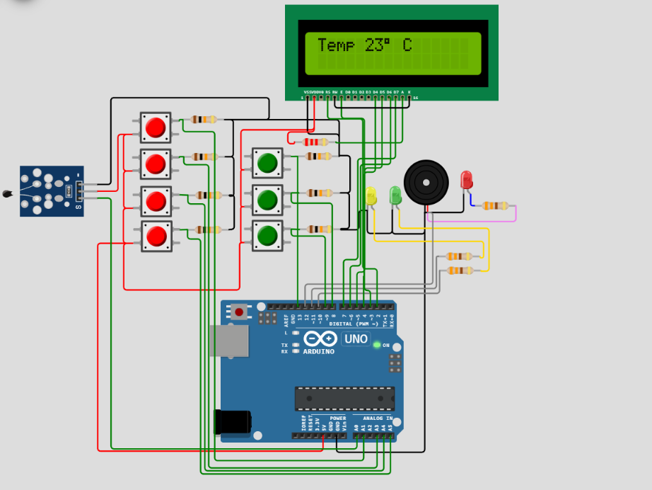
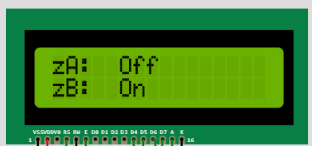
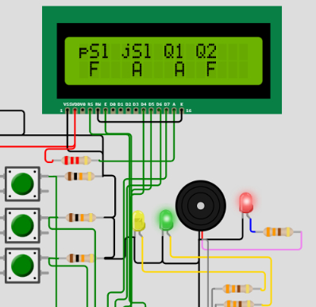

# Sistema de Alarme Arduino
------------------
### Descrição do projeto: 
Sistema de alarme simples simulando sensores que detectam abertura/fechamento de portas/janelas, utilizando Linguagem C para o ATMEGA328P do Arduino Uno R3.

### Escopo funcional / Lista de materiais: 

- 4 Sensores para detectar a Abertura/Fechamento de portas e janelas.
- 1 Sensor analógico de temperatura.
- 1 Botão para Ativar/Desativar o Alarme.
- Um buzzer deve ser ativado sempre que um dos sensores detectar a abertura da porta/janelaou quando a temperatura exceder 30,0°C.
- Indicação de Zona através de dois LEDs, onde:A = Sensores 1 e 2 –Sala/Cozinhae B = Sensores 3 e 4 –Quartos.
- Possibilidade de desativar uma zona.g)Sempre  que  um  dos  sensores  for  ativado,  ou  seja,  enviou  nível  1  (HIGH)  ao microcontrolador,enviar uma mensagem através da porta serial.
- Exibir  as  informações  em  um  display  de  LCD  (estado  dos  sensores,  zonas  e temperatura).

### Montagem simulada:
Fotos :

### Código-fonte:
([Clique aqui](https://github.com/jonas4040/sistema-alarme-arduino/blob/main/src/sistema_alarme_2sem_2022.c)) .

### Faça um teste utilizando o seu computador:
Clique no link abaixo e ao lado do botão save, clique em save a copy, depois no botão play para simular.
([Projeto Montado no Simulador Wokwi](https://wokwi.com/projects/348243774428676691))
